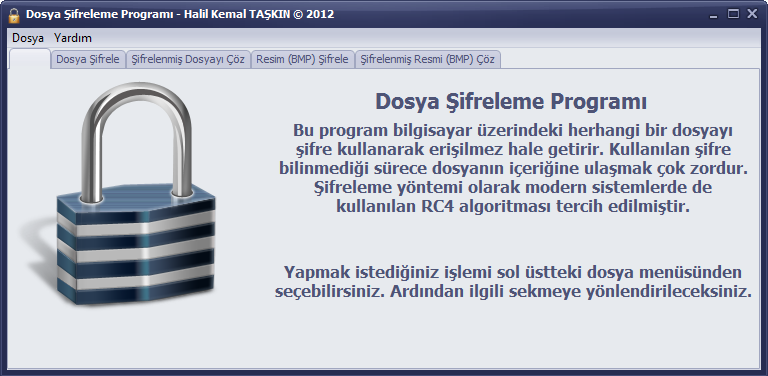

RC4 Dosya Þifreleme Programý
============================
Bu proje, Beltek C++Builder eðitimi kapsamýnda bitirme projesi olarak geliþtirilmiþtir. Program [RC4](http://en.wikipedia.org/wiki/RC4) akýþ þifre algoritmasýný kullanarak dosyalarý þifrelemeyi saðlar.

Proje, “Embarcadero RAD Studio C++Builder XE2 Update 4” tümleþik geliþtirme ortamýnda VCL ktütüphanesi ile C++ programlama dili kullanýlarak yazýlmýþtýr.

Normal dosya þifreleme desteðinin yanýnda Bitmap (BMP) resim dosyalarý için özel þifreleme yöntemi uygulanmýþtýr. Bu sayede dosyadaki bitmap baþlýðý (header) þifrelenmemekte, sadece piksel verileri þifrelenmektedir. Böylece þifrelenmiþ resimler de görülebilmektedir.

Program da ayrýca kullanýcýlarýn þifre seçimine yardým etmek için, rastgele þifre seçme ekraný da vardýr.

Programýn çalýþmasý için 6 adet [Borland VCL](http://en.wikipedia.org/wiki/Visual_Component_Library) kütüphanesine ihtiyaç vardýr. Bu dosyalar ve Windows 32-bit sürümleri için derlenmiþ .exe dosyasý [DerlenmisProgram.zip](DerlenmisProgram.zip) dosyasýndan indirilebilir.

Programýn kullanýmý ve detaylarýný [Proje Raporu](ProjeRaporu.pdf) dosyasýndan indirebilirsiniz.

Programýn örnek ekran görüntüsü aþaðýdadýr.

